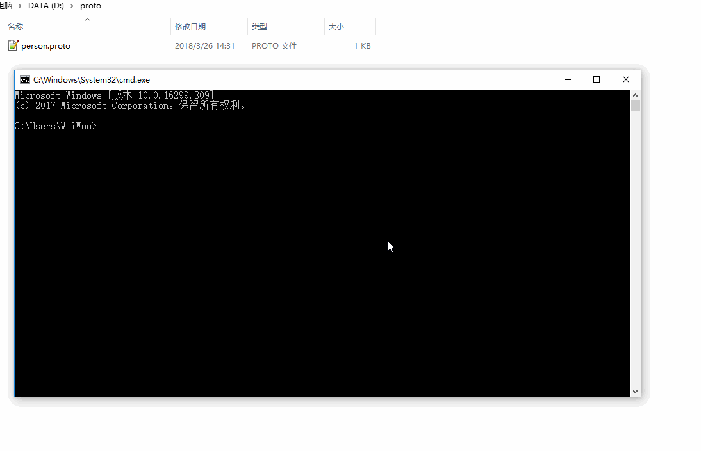

> # 前端protobuf入门

> 此文只讲述web前端与后端使用protobuf进行数据交互的基础与入门教学，更加详细的内容请查看google protobuf[官方文档](https://developers.google.com/protocol-buffers)以及protobuf项目[github地址](https://github.com/google/protobuf)
> 

> ### 准备工作

> 1.下载protobuf编译器，[下载地址](https://github.com/google/protobuf/releases), 我的编程环境的Windows平台，所以这里找到并下载protoc-3.5.1-win32.zip，解压出来放到一个你希望放的地方，我这里放在D盘的根目录

> 2.配置环境变量，配置环境变量只是为了方便命令行编译，所以不一定要配置，环境变量配置到bin目录就好了

> 3.新建一个测试用的.proto文件
```
// person.proto  文件
// package 请与需要使用语言的package目录一致

syntax = "proto3";
package com.etertops.protos;

message PersonMessage{
    string id = 1;
    string name = 2;
    string sex = 3;
    string address = 4;
    int32 age = 5;
    string phone = 6;
}
```
> 4.编译文件： protoc --java_out=输出目录 需要编译的文件
> 比如我在文件目录使用protoc --java_out=./ person.proto 编译person.proto编译到当前目录，其他编译请查看官方文档
> 

> ### 搭建后台服务器

> 我这里使用的是Spring boot，服务器语言使用的是java，所以上面编译的也是java，关于服务器怎么搭建，这里不做讲述，大家自己搜索。

> 1.把编译好的Person类拷贝到项目对应的目录下，

> 2.新增一个控制器用于前端访问,为了方便传输对数据进行了base64编码
```
// 请先引入依赖
// 依赖仓库地址
https://mvnrepository.com/artifact/com.google.protobuf/protobuf-java
// maven引入
<dependency>
    <groupId>com.google.protobuf</groupId>
	<artifactId>protobuf-java</artifactId>
	<version>3.5.1</version>
</dependency>

// 控制器内容
@CrossOrigin(origins = "*", maxAge = 3600)
@RestController
@RequestMapping("proto")
public class ProtobufController {

    @RequestMapping("/get")
    public byte[] send(){
        Person.PersonMessage.Builder personBuilder = Person.PersonMessage.newBuilder();
        personBuilder.setId("test001");
        personBuilder.setName("user test");
        personBuilder.setSex("male");
        personBuilder.setAddress("湖南省长沙市岳麓区银盆岭岳麓大道绿地中央广场");
        personBuilder.setAge(18);
        personBuilder.setPhone("18816881688");
        Person.PersonMessage person = personBuilder.build();
        return Base64.getEncoder().encode(person.toByteArray());
    }
}
```

> ### 前端web页面接收protobuf数据, 使用protobuf.js
```
// axios.js 用于发起请求
// protobuf.js用于处理protobuf数据，
// github地址: https://github.com/dcodeIO/protobuf.js

<!DOCTYPE html>
<html lang="en">
<head>
    <meta charset="UTF-8">
    <title>Protocol Buffer</title>
    <script src="axios.js"></script>
    <script src="protobuf.js"></script>
</head>
<body>
<h1 style="width: 100%; text-align: center">Protocol Buffer Data Test!</h1>
</body>
<script>
    axios.get("../proto/get").then(function (value){
        protobuf.load('../protos/person.proto').then(function (root) {
            var personMessage = root.lookupType('com.etertops.protos.PersonMessage');
            var buffer = new Uint8Array(protobuf.util.base64.length(value.data))
            protobuf.util.base64.decode(value.data, buffer, 0)
            var person = personMessage.decode(buffer);
            console.log(person)
        });
    })
</script>
</html>
```

> ### 前端web页面发送protobuf数据到后端

> 为了数据稳定，需要先把uint8array转成base64编码的字符串
```
    function uploadData() {
        protobuf.load('../protos/person.proto').then(function (root) {
            var personMessage = root.lookupType('com.etertops.protos.PersonMessage');
            var payload = {
                id: 'test id from html',
                name: 'protobuf.js',
                sex: '男',
                address: '中华人民共和国',
                age: '16',
                phone: 'made in china'
            };
            var message = personMessage.create(payload);
            var buffer = personMessage.encode(message).finish();
            var b64 = protobuf.util.base64.encode(buffer, 0, buffer.length)
            var fd = new FormData();
            fd.append('proto', b64);
            axios.post('../proto/post', fd).then(function (value) {
                console.log(value)
            })
        });
    }
```
> 为什么要转成base64的字符串，我这边是为了方便数据传输，
> 我直接上传Uint8Array字符数字，在后台解码时，不是获取不到数据就是各种错误。
> 欢迎各位告诉我java怎么处理接收和处理Uint8Array数据
> #### 如果您有更好的方法，还请赐教！

> 后端接收代码
```
@RequestMapping(value = "/post", method = RequestMethod.POST)
public void post(String proto){
    try {
        Person.PersonMessage pm = Person.PersonMessage
            .parseFrom(Base64.getDecoder().decode(proto));
        System.out.println("id： " + pm.getId());
        System.out.println("name： " + pm.getName());
        System.out.println("sex： " + pm.getSex());
        System.out.println("address： " + pm.getAddress());
        System.out.println("age： " + pm.getAge());
        System.out.println("phone： " + pm.getPhone());
    } catch (Exception e) {
        e.printStackTrace();
    }
}
```

> ### Java 后台接收protobuf数据
```
@RequestMapping(value = "/post", method = RequestMethod.POST)
public void post(String proto){
    try {
        Person.PersonMessage pm = Person.PersonMessage
            .parseFrom(Base64.getDecoder().decode(proto));
        System.out.println("id： " + pm.getId());
        System.out.println("name： " + pm.getName());
        System.out.println("sex： " + pm.getSex());
        System.out.println("address： " + pm.getAddress());
        System.out.println("age： " + pm.getAge());
        System.out.println("phone： " + pm.getPhone());
    } catch (Exception e) {
        e.printStackTrace();
    }
}

//打印信息
id： test id from html
name： protobuf.js
sex： 男
address： 中华人民共和国
age： 16
phone： made in china
```


> ### 前端接收protobuf收据，使用google-protobuf，并给后端传递数据

> #####需要node环境
> 为了方便测试，我在这里使用vue-cli快速搭建一个vue应用，使用其他的node开发环境也是可以的，在此只是方便测试！

> 关于怎么使用vue-cli的使用，这里不讲，还请自己搜索！

> 安装依赖 npm install google-protobuf axios --save

> 由于只是测试，我们直接在APP.vue中写测试代码

> 通过protoc编译js文件

> 比如我在文件目录使用protoc --js_out=import_style=commonjs,binary:. person.proto 编译person.proto编译到当前目录，生成person_pb.js文件

> 直接把编译好的js文件放到vue测试项目的src目录下，由于eslint的原因，文件可以会报错，在文件头部加 /* eslint-disable */ 忽略错误

> ### 前端App.vue代码
```
<template>
  <div id="app">
    <h1 style="width: 100%; text-align: center">Protocol Buffer Data Test!</h1>
    <button style="outline: none; background: yellowgreen; color: wheat" @click="uploadData()">上传数据</button>
  </div>
</template>

<script>
import person from './person_pb'
import axios from 'axios'
import goog from 'google-protobuf'
export default {
  name: 'App',
  created () {
    axios.get('http://localhost:8080/proto/get').then(res => {
      let pm = person.PersonMessage.deserializeBinary(res.data)
      let protoBuf = pm.toObject()
      console.log('protoBuf: ', protoBuf)
    })
  },
  methods: {
    uploadData () {
      let pm = new person.PersonMessage()
      pm.setId('id from google protobuf')
      pm.setName('google protobuf')
      pm.setSex('超人')
      pm.setAddress('中华人民共和国湖南省长沙市')
      pm.setAge(17)
      pm.setPhone('made in changsha')
      let bytes = pm.serializeBinary()
      let b64 = goog.Message.bytesAsB64(bytes)
      let fd = new FormData()
      fd.append('proto', b64)
      axios.post('http://localhost:8080/proto/post', fd).then(function (value) {
        console.log(value)
      })
    }
  }
}
</script>
<style>
</style>
```
>
>